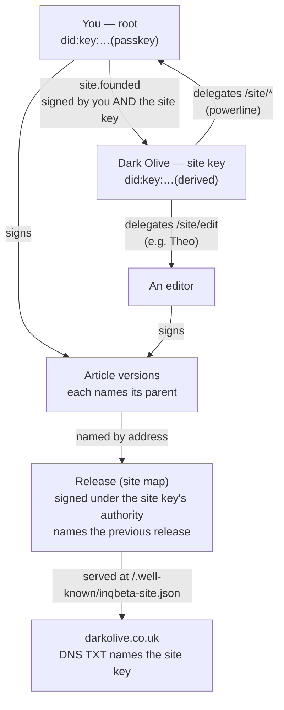

# ADR-Q-003: A website is a key, founded by you

**Status: accepted, 24 September 2026 (Darren: "agree with your proposal … proceed").**
Decision 1 is made (§1 and §8). The other open decisions are at the end.

**Built so far, 24 September:**

- `q-core/sites.ts`: `foundSite`, `checkFounding`, `openSiteKey`, `grantSite`,
  `actFor` and `checkAuthority` (§1–3). Eight tests with real keys and real UCAN
  (`test/sites.test.ts`) cover:
  - two-signature founding;
  - tampering caught;
  - random keys;
  - only the owner opens the key;
  - founder may act, a stranger may not;
  - an editor may edit but not publish;
  - revocation ends authority.
- Q, **Custom → Sites**: found a site, with a warning to keep backups. Each site
  shows its key, its founder, three checks (founding holds, key opens, grant
  from site to founder) and the DNS TXT record for the domain.
- Stored at `sites/<domain>.json` in the vault, signed by the founder. The grant
  is also kept in `ucan/`.

**Write, built 24 September (§4):**

- `q-core/publication.ts`: an article as text (header plus body) ↔ blocks.
  Round-trip proven: every one of the 18 Dark Olive pages, opened as text and
  saved unchanged, gives the same page address
  (`test/publication-roundtrip.test.ts`).
- `q-core/articles.ts`: signed article versions. Each carries the page, its
  address, its parent, and a `/site/edit` invocation with its grants. Five tests
  cover:
  - the founder may write, and an editor may write;
  - a stranger may not;
  - tampering is caught;
  - a version for another site is refused.
- Q, **Custom → Write**:
  - pick the site;
  - open any article as text, or start a new post or project;
  - see live problems as you type, and a preview in Dark Olive's own templates
    (its `/preview` page, dev-only, which listens only to Q on localhost);
  - **Save a version** signs it into the vault;
  - **Publish to the site** hands the signed version to the site's source.
- `apps/q/src/routes/api/local-site`: the one door to a site's files. It works
  only in development (404 when deployed) and writes a page only when the
  version checks out against the site's founding and its edit authority.
  Tested: a real version published byte-identical, a stranger's version
  refused (422), and an unknown domain refused (404).

**Built 24 September — releases signed under the site, carried to Vercel (§5):**

- `q-core/releases.ts`: `signRelease` / `checkRelease`. A release is the site
  map with `site`, `authority` (a `/site/publish` invocation naming this
  domain and this exact map) and `grants` (the chain from the site key). The
  map is named by its core (`mapId`), and each release names what was live
  before it (`previous` = `releaseId`). Tested: founder releases; an editor
  (`/site/edit`) cannot; someone given `/site/publish` can; a stranger,
  another site's founding, or a changed file is refused.
- `api/local-site/release` (dev only): `POST` builds the site on this
  computer and returns the map, with what is live now as `previous`; `PUT`
  takes a signed release, carries it only if it checks out AND the build on
  disk is byte for byte what it signs, writes it to
  `/.well-known/inqbeta-site.json`, sends the build to Vercel, then fetches the
  live release and home page back and checks them.
- Write's **Publish** now goes all the way: version → site source → build →
  sign → keep in `sites/<domain>/releases/` → carry → check.
- Sites shows where each site is served and its last release, and can keep a
  Vercel token sealed to the owner (`sites/<domain>/carriers/vercel.json`).
  Without one, this computer's own `vercel login` is used.

**Next:** new pictures from Write, the vault hardening, then more carriers
(Cloudflare, the mini PC, a federation's nodes) and handover (§8).

> Darren: *"For that to work, you need to have the keys of the website you want
> to work on in your key set of Q … same principle as in Federation: you start
> with the first primary signer, the user, and then everything from that is
> the build."*

## The chain

Everything about a site walks back to one passkey touch:

Read from the bottom up, any visitor can check: this page is in a release, the
release was signed with authority from the site key, the site key belongs to the
root that founded it, and the domain names that same site key.

## The parts

### 1. The site key: an asset in your key set, not a part of you

**Decided 24 September (Darren):** *"a website is an asset and you can sell on
a website … you can pass that key to another person and then they own the
sovereignty."*

So a site key is **random**, not derived from your passkey. It is kept in your
vault, sealed to your DID, the same way anything is sealed to a person
(`sealTo`). While you are signed in it sits in your key set beside your own
keys. It never depends on your passkey, which is exactly what lets it leave
you.

- **Losing it is the risk that comes with owning it.** It travels with your
  vault backups ("Back up now") and copy locations. Q should say so plainly when
  the site is founded.
- **`generation` counts rotations.** A new key for the same site is generation
  2, 3 and so on. Everything an earlier generation signed stays signed.

### 2. Founding: two signatures, like a link and like a federation

`site.founded { root, site, domain, name, generation }` is signed by **both** the
root and the site key. This is the genesis rule again, the same one `links.ts`
uses. Neither signature alone founds anything: a site cannot be claimed for a
root that didn't agree, and a root cannot claim a key it doesn't hold.

The site key then **delegates** to the root a powerline UCAN (`sub` = site,
`cmd` = `/site`). Day to day, you sign with your own key and show that
delegation; the site key itself is only touched to found, rotate or add people.

### 3. Who may do what: UCAN commands

| Command | Lets them | Who gets it |
|---|---|---|
| `/site/edit` | Write and sign drafts and article versions | You, and anyone you invite (Theo, a partner) |
| `/site/publish` | Sign a release (site map) | You, by default only you |
| `/site/admin` | Invite, revoke, rotate | You |

Built on what exists: `ucan/token.ts` delegate/invoke, `ucan/revoke.ts`,
`ucan/validate.ts`. Revoking an editor is `/ucan/revoke` on their delegation,
forward only.

### 4. An article is a chain of versions

Each save is a **version receipt**:
`{ site, article: "greenspacedarkskies", page: content://…, parent: <previous version>, by }`.
It's signed by whoever wrote it, and valid if that signer holds `/site/edit`.

- **Draft and published are just positions in the chain.** A release names
  exactly one version of each article.
- **History is free.** Who changed which line, and when, is the chain itself.
- **Branches** (two editors at once) are two children of one parent. Merging is
  choosing, and the choice is itself a version.

### 5. A release is the site map we already sign

`q-core/site.ts` stays as it is, plus two fields:

- `site`: the site key's DID;
- `proof`: the delegation chain from the site key to whoever signed it.

`checkSite` then also checks the signer holds `/site/publish` under that site.
`previous` already chains releases.

### 6. The domain names the key

Two directions, so neither side can be faked on its own:

- **Domain → key:** a DNS TXT record `_inqbeta.darkolive.co.uk` = the site DID.
  Only whoever controls the domain can set it.
- **Key → domain:** `site.founded` names the domain, and every release is served
  from it at `/.well-known/inqbeta-site.json`.

### 7. Where it lives

- **Your vault** holds the source of truth. `sites/darkolive.co.uk/` contains
  `site.json` (the founding receipt), `ucan/` (the delegations), `articles/<slug>/`
  (the version chain) and `releases/`.
- **The repo's `apps/darkolive/src/content/pages/`** holds what gets built: the
  published version of each article, written out by Q. It stays in git as it is
  today.
- **Q writes to the repo only when running locally** (a dev-only endpoint, or
  the folder picker). The deployed Q cannot touch website files.

### 8. Selling or handing over a site

A key cannot be un-known. Once the old owner has held it, handing over a copy
is not handing over control, because they still have one. So a transfer is a
**handover followed by a rotation**:

1. `site.transferred { site, from, to }` is signed by the current site key and
   the current owner, then countersigned by the new owner (the genesis rule
   again: nothing lands on somebody who didn't accept it).
2. The new owner founds the next generation, a fresh key only they have ever
   held. The old generation's last act is to endorse it.
3. The old owner's delegations are revoked. The buyer updates the DNS TXT record,
   since they now control the domain.

After that, the chain shows who owned the site, when it changed hands and who
agreed. The old owner's copy of the old key can no longer publish anything a
verifier would accept, because a newer generation exists and the handover says
so. Past releases stay theirs, signed and valid.

## Later phase: publishing from the device, and a vault that cannot lose a site

*Added 24 September. Darren: "the vault is a major feature … we really need
this to be so bulletproof … give it a lot of attention when we come to it."*

### The shape: the device signs, the cloud carries

Your vault already works this way: the device holds the original, the network
holds copies. Publishing a site should work the same way.

1. **Sign on the device.** On a phone or a Mac, one passkey touch signs the
   release under the site key.
2. **Push to several hosts at once:** Vercel, Cloudflare, Darren's mini PC at
   home (behind a Cloudflare Tunnel, so no open ports and no dependence on BT's
   IP), and IPFS. Files are named by their hashes and the release is signed, so
   no host is trusted. Any copy can be checked.
3. **The name.** Two routes, not exclusive:
   - **Ordinary DNS, written by Q** through a scoped registrar or Cloudflare
     API token: the A/CNAME record, and the `_inqbeta` TXT record naming the
     site key.
   - **No registrar at all:** the site key publishes its own records on the
     BitTorrent Mainline DHT (BEP 44, Pkarr, `did:dht`; see
     `docs/q/research-2026-09-20-mainline-addressing.md`). The site key is
     already Ed25519, which is what the DHT requires. Records expire after
     about 2 hours, and a phone cannot be relied on to republish them. So the
     device signs a record once, and a relay (the mini PC, or a cloud
     republisher) keeps re-announcing it. The relay cannot change it, because
     only the key can sign a new `seq`.

Nobody who carries the site can alter it.

### The vault has to be bulletproof first

Site keys make the vault hold *assets*, not only records. Losing the vault would
mean losing the power to publish or sell a site, so this phase starts with the
vault, and each point needs tests:

- **Backups that are proven, not assumed.** A backup counts only once it has
  been restored and checked: every file hash-matches, and every sealed site key
  opens. "Back up now" should end with that check.
- **More than one place.** A site key is refused a home in a vault with fewer
  than two copy locations, or the person is told plainly what that means.
- **Recovery that doesn't depend on one device.** The site key is sealed to more
  than one of your linked devices (`sealTo` already takes a list). Optionally it
  is also sealed in shares to people you trust (for example 2 of 3), so a lost
  phone or Mac is not a lost site.
- **Nothing silent.** Every place a key is written, copied, rotated or handed
  over leaves a receipt, and Q shows how many independent copies of each site
  key exist right now.
- **Handover survives it all.** §8 depends on these: a sale must not leave a
  stray copy that still publishes (rotation), or a buyer with no backup
  (proven restore on their side before the old generation retires).

This comes after Write and releases signed under the site. It is not needed for
Dark Olive's launch, but it is needed before any site's key is the only thing
standing between an owner and their asset.

## What you would do

1. **Q → Sites → Add a site.** Name it Dark Olive, domain darkolive.co.uk, touch
   the passkey. The site key is made and sealed into your vault, founding is signed, and Q shows the DNS
   TXT record to add whenever you switch the domain.
2. **Q → Write.** Open Dark Olive and pick an article or start a new one. Write,
   save (a version), and publish (write it out to the repo).
3. **Release** as now: build, site map, sign. The one change is that the
   signature is now under Dark Olive's key rather than yours alone.

## Migration

Yesterday's release was signed by your root DID directly. The first release
after founding names it as `previous` and is signed under the site key, so the
history joins up. The 18 pages already in the repo become version 1 of each
article, signed by you under `/site/edit`.

## Open decisions

1. ~~Derived or random site key?~~ **Random, kept in the vault, transferable.**
   Decided by Darren on 24 September; see §1 and §8.
2. **Does publishing need a second signer?** For example, Theo or a partner
   countersigning a release. The UCAN multi-sig condition in `keys.ts` could
   carry it. The proposal is no, not for now.
3. **Federation sites.** A site founded by a federation rather than a person
   works the same way, with the federation's key as root. That's worth building
   in the same shape but not now.
