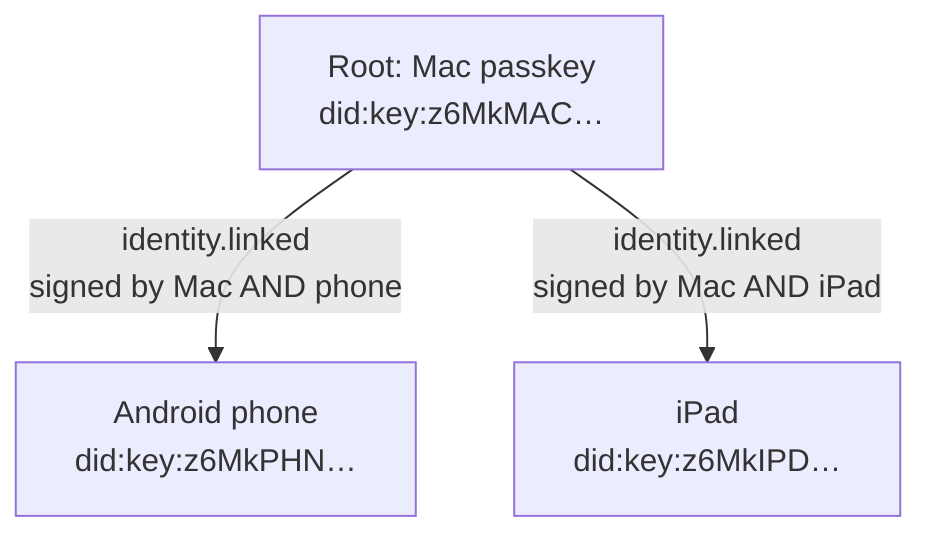
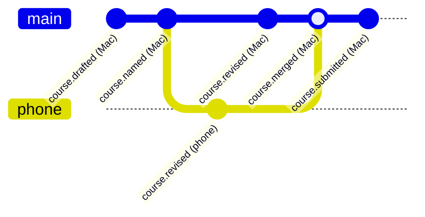

# Devices and branches — proposal

**Status: part built.** Written 2026-09-16 from Darren's direction. **Link
receipts are built** (`packages/q-core/src/links.ts`) — since the UCAN decision the
same day, as a UCAN request plus a powerline delegation ([ucan-in-q.md](ucan-in-q.md)) — and used for site keys: each
site signs in on its own and links its key to your root (decided 2026-09-16). Links
cover the key's whole history; unlinking is forward only. Still to build: the shared
folder key wrapped per linked key, and branch/merge receipts. The open decisions
are at the end.

> *"Every action one has on the site that requires an attestation is effectively a
> Git version branching. That branch has its own truth relative to its own path,
> but it still goes back to a source of truth that it originates from."*
>
> *"If I signed in with my phone and it had a different fingerprint — an Android,
> and my computer's a Mac, so they're not the same keychain — I still want it on
> the same folder, but if I do anything through one particular device, maybe it
> creates its own key link."*

## The problem it solves

Today one passkey is one identity. A Mac keychain and an Android keychain are two
passkeys, so they are two unrelated people: different DIDs, different folder keys,
and nothing connecting what either signs.

## The idea in three parts

### 1. One root, many device keys — linked, not shared

Each device keeps its own passkey and its own DID. Nothing secret is copied
between devices. Instead, devices are **linked** to a root identity by receipts:



- `identity.founded` — the first passkey signs itself in as the root.
- `identity.linked { root, device, label }` — signed by **an already-linked key
  and the new key**. Neither signature alone links anything: the genesis rule
  again. A device cannot be added behind the person's back, and a key cannot be
  claimed without its own owner agreeing.
- `identity.unlinked { device, reason }` — signed by a linked key. Forward only:
  what the device signed before stays signed.

These are ordinary receipts in an ordinary chain. The verifier walks
*device → link → root* and says, in words: *"Signed by 'Darren's phone', a device
linked to did:key:z6MkMAC… on 16 September 2026."* Still never "trusted".

### 2. One folder, a key wrapped for each device

The folder stops being locked with a key derived from one passkey, and is locked
with a **folder key** — 32 random bytes made once. That key is *wrapped* to each
linked device exactly as `sealTo` wraps a content key:

```json
{
  "schema": "dostudy.folder/2",
  "root": "did:key:z6MkMAC…",
  "keys": [
    { "did": "did:key:z6MkMAC…", "ephemeral": "…", "iv": "…", "wrapped": "…" },
    { "did": "did:key:z6MkPHN…", "ephemeral": "…", "iv": "…", "wrapped": "…", "link": "<hash of its identity.linked receipt>" }
  ],
  "links": [ …the link receipts themselves… ]
}
```

Any linked device unwraps the folder key with its own opening key. Adding a device
= an existing device unwraps the key and wraps it again for the new DID. Nothing
secret travels between the devices; only the new device's public DID does.

Removing a device = a new folder key, every file re-locked, wrapped only for the
devices that remain. Honest limit: anything the removed device already copied out,
it keeps.

### 3. Every attestation a branch

Each device signs onto **its own branch**. A receipt names its parent, so a branch
is its own truth relative to its own path, and every path walks back to where it
started:



The kernel change is small: `previousHash` becomes `parents: string[]` (one parent
for a step, two for a merge), with `previousHash` kept for older receipts. A merge
is itself a receipt, signed by whoever merged, so *who reconciled two versions* is
evidence too. The version history the verifier already computes ("3 parts
reworded") works per branch.

## How little a receipt needs

With branches, a receipt shrinks to a pointer:

```json
{
  "schema": "dostudy.receipt/2",
  "event": "course.revised",
  "at": "2026-09-16T14:02:11.000Z",
  "subject": "ceqf-3f9a…",
  "contentHash": "<SHA-256 of the source>",
  "parents": ["<hash of the receipt before>"],
  "by": "did:key:z6MkPHN…",
  "link": "<hash of the identity.linked receipt that authorised this device>",
  "signature": "…"
}
```

A few hundred bytes. The **source** — the unit, the image, the note — lives in the
locked folder, found by its hash. The receipt does not need to carry it, and does
not need to know where it is: a location is a claim, the hash is the fact. A
`where` hint (e.g. the `.dsv` name) can ride alongside, outside the signature.

## Pairing without a server

1. **New device** — Passkey tab → *Link this device*. Makes its passkey, shows its
   DID as a QR code and text.
2. **Existing device** — Passkey tab → *Add a device*. Scan or paste the DID, give
   it a label. It signs its half of `identity.linked` and wraps the folder key for
   the new DID into `dostudy.json`.
3. **New device** — opens the same folder (synced), finds the pending link, signs
   its half. Now linked; the folder opens.

If the folder is not shared between the devices, step 2 produces a small *link
file* instead, carried however files are carried.

## What stands in the way

- **Android Chrome and iPhone Safari have no folder picker.** A phone can link, sign
  and open sealed receipts today, but cannot open a desktop folder from the
  browser. Options: the phone keeps its own locked store (the browser's private
  storage) and exchanges files; or a small installed app later.
- **Sync conflicts.** Two devices writing `dostudy.json` at once through a sync
  service can clobber each other. The link receipts must be the truth and the key
  list rebuilt from them — the same rule as journal over projection.
- **Migration.** Folders made today are locked with the passkey-derived key. The
  first open under version 2 re-locks every file with a new folder key.

## Decisions for Darren

1. **Who may add a device?** Any linked device, or only the root?
2. **Who may remove one?** Any linked device, only the root, or two devices together?
3. **Losing the root.** If the Mac is lost but the phone is linked, may the phone
   become the root? (Makes recovery possible; also makes a stolen phone more powerful.)
4. **Merging.** Is a merge automatic when branches do not touch the same parts, or
   always a person's decision?
5. **Phones and the folder.** Private browser storage plus file exchange now, or
   wait for an app?
6. **Naming.** This deserves a name of its own as a standalone system.
