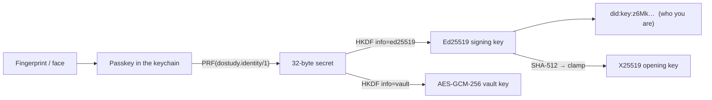

# How it works

## 1. From a fingerprint to an identity

A passkey's own signature cannot be the identity: it signs a fresh challenge every
time, and its public key is handed over only once, at creation, so using it would
mean storing it somewhere.

Instead the **WebAuthn PRF extension**. The page gives the passkey a fixed input —
`SHA-256("dostudy.identity/1")` — and the passkey returns a 32-byte secret. The
same passkey on the same site returns the same secret every time; nobody without
the passkey can compute it. Everything else is derived from that secret, in
memory, on every sign-in:



| Key | Used for | Extractable |
|---|---|---|
| Ed25519 private | signing receipts | inside the page only |
| X25519 private | opening what was sealed to your DID | no |
| AES-GCM vault key | locking the folder | no |

The secret and the derived seeds are zeroed after use. The keys are held in a
module variable for the life of the tab and never written anywhere. The only thing
remembered between visits is the **public** DID (`localStorage`,
`dostudy-passkey-did`), so the header can offer "touch to carry on".

The WebAuthn assertion is **not verified** — there is no server to verify it
against, and nothing needs it. The security is that only the passkey can produce
the PRF output.

### What changes the identity

- `IDENTITY_INPUT` in `passkey.ts`. Change it and everyone gets a new DID.
- **The domain.** A passkey belongs to one site: `localhost`, a Vercel preview and
  `darkolive.co.uk` give three different DIDs from the same fingerprint.
- **A different passkey** — including the same person's passkey in another
  browser's keychain.

## 2. did:key

`did:key:z` + base58btc( `0xed 0x01` + 32-byte Ed25519 public key ). Nothing is
looked up; the key *is* the name. `publicKeyFrom()` also accepts the base64url
public key found in a receipt signature, so anyone who has signed a receipt can
be sealed to straight from the receipt.

The X25519 key for sealing is **converted** from the Ed25519 key (`u = (1+y)/(1−y)`,
the map used by libsodium and the did:key spec), so a DID is all a sender needs.
The smoke test checks that the key converted from the DID agrees with the one the
passkey rebuilds.

## 3. Sealing to people — `sealTo` / `openWith`

```
content key  = 32 random bytes
ciphertext   = AES-GCM(content key, canonical(body))
for each recipient DID:
  eph        = new X25519 key pair
  shared     = X25519(eph.private, recipient X25519)
  wrap key   = HKDF-SHA256(shared, salt = eph.pub ‖ recipient.pub, info = "dostudy.sealed/x25519")
  wrapped    = AES-GCM(wrap key, content key)
```

Envelope (`schema: dostudy.sealed/1`, `alg: AES-GCM-256/X25519-HKDF-SHA256`):
`iv`, `ciphertext`, `forWhom`, and `recipients[] = { did, ephemeral, iv, wrapped }`.

- **Who it is for is in the clear.** A reader can say "your passkey is not one of
  the three" instead of failing mysteriously.
- **Nothing is compared against a list.** The gate is whether the key unwraps; an
  entry copied under someone else's DID still does not open (asserted).
- **The receipt signs the plaintext hash.** It is built from the plaintext, then
  the body is swapped for the envelope, so what comes out of an opened seal is
  checked against what was signed. A sealed receipt verifies exactly as well as an
  open one.

## 4. The locked folder

The File System Access API gives the page a handle to a folder the person chose.
The handle is kept in IndexedDB (`dostudy` → `folders`), **keyed by DID**, so each
passkey has its own folder.

On disk:

```
DoStudy/
  READ ME.txt                       plain: "this folder is locked…"
  dostudy.json                      plain: which DID, and a check phrase
  62c7b4592aab073a6c5ae1e0.dsv      locked
  6230bf95446f44c09303e96d.dsv      locked
```

`dostudy.json`:

```json
{
  "schema": "dostudy.folder/1",
  "did": "did:key:z6Mk…",
  "made": "2026-09-16T…",
  "locked": true,
  "check": "<a known phrase, locked with the vault key>",
  "note": "…"
}
```

The check is how a wrong passkey is caught once, up front — including a second
passkey that edits `did` to claim the folder (asserted in the browser test).

### The `.dsv` format

```
"DSV1" · 12-byte IV · AES-GCM( 4-byte BE length · JSON meta · file bytes )
meta = { name, path, type, size, saved }
```

The real name, type and group (`receipts`, `reads`, `notes`, `files`) are inside
the encryption; the name on disk is 12 random bytes in hex. What is **not**
hidden: how many files, their sizes, when they changed.

### States

`checking → unsupported | no-identity | none | asleep | ready | lost`

- **asleep** — remembered, but the browser wants a tap before the page may touch
  it again (Chrome can offer "allow on every visit").
- **lost** — moved, deleted, belongs to another passkey, or does not open with
  this one.

Saving (`saveOut`) goes into the folder, locked, when the folder is ready **and**
the keys are unlocked; otherwise it downloads, as it did before the folder existed.

## 5. Offline

`src/service-worker.ts` keeps the built app, every prerendered page and the small
static files. Photographs are kept as they are viewed; narration audio never.
Pages are network-first so a deploy shows at once; `/api/*` is never cached. An
unvisited `/dostudy/*` address offline still opens the tabs.

## 6. The tabs share one page

`src/routes/dostudy/+layout.svelte` holds the five panels; the page files hold only
titles. SvelteKit keeps a layout mounted between its child routes, so switching tabs
never reloads — the keys stay unlocked and each tab keeps its work. A dropped file
goes through `shared-file.ts` so Read and Verify both see it; `tab-active.ts` stops
hidden panels catching drops meant for the visible one.
