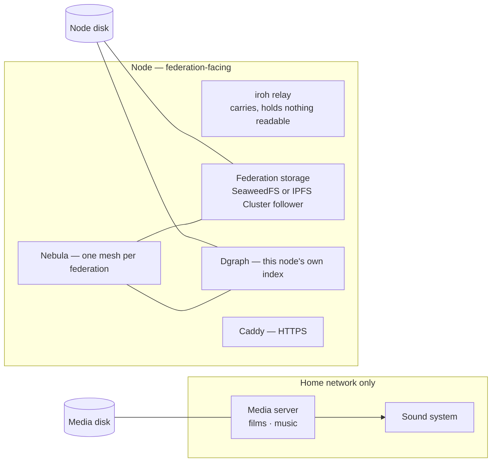

# The home node: one box, a media server and a federation node

**26 September 2026. Design, not built.** Darren's mini PC at home runs two
things side by side: his own media (films, music, the sound system) and an
inQbeta node, meaning a relay, storage and index for the federations it joins.
The node should be something anyone can install on any machine able to run it.
This box is where we test it first: Dgraph, relaying, storage, and what a
federation needs when it forms, including its own private network.

This doc records the direction agreed today. It is the brief for the research
that comes next (§8).

---

## 1. The direction in one paragraph

**Docker Compose, not Kubernetes.** A node is one Compose file that says what
it runs, which is ADR-Q-006's rule ("manifest before code") applied to
infrastructure. **The media side and the node side share the hardware but
not the network.** A federation never sees the films. **Two network layers.**
Receipts move between devices by dialling keys (iroh). Infrastructure
services that expect IP addresses sit on **one private WireGuard mesh per
federation**, and Nebula is the first candidate. **Each node keeps its own
Dgraph** and builds its index from the receipts the federation shares. We do
not stretch one Dgraph cluster across homes. The test will show whether that
expectation holds.

## 2. Why not Kubernetes

Kubernetes solves one owner running many machines over a fast private
network. A federation is the opposite: many owners, each with one box, joined
over home broadband. A federation has no single operator to run Kubernetes,
and that is by design.

Compose fits:

- **One file is the node.** It can be read, hashed, signed and approved like
  a component manifest. A federation could publish the file its members run.
- **It runs on anything** that runs Docker: a mini PC, a NAS, a spare laptop
  or a rented server.
- **Escape hatch:** if one member ever runs many machines, k3s (a lightweight
  Kubernetes) accepts much the same containers. Nothing here closes that door.

## 3. One box, two sides



- **Separate Docker networks.** The media containers never join a
  federation's network. Nothing from a federation can reach them.
- **Separate storage folders, and ideally separate disks,** so a full
  federation volume cannot fill the media disk, and the reverse.
- **Shared fate, stated honestly.** Anything this node holds for a federation
  is lost with the box, along with the films. In `howSafe()` terms the node is
  one fate, however many federations it serves. A federation must never count
  two of its copies on the same box as two ways to survive.

## 4. The two network layers

| Layer | Carries | Tool (first candidate) | Why |
|---|---|---|---|
| **Keys** | Receipts, calls' signalling, relayed bundles between devices | **iroh**: dial a public key, get a direct, hole-punched or relayed path | A DID is a key. No VPN needed, and phones take part. |
| **Infrastructure** | Dgraph, SeaweedFS or IPFS Cluster traffic between nodes | **WireGuard mesh, one per federation** | These services expect stable IP addresses on a private network |

### One mesh per federation: the options

| Option | How you join | Needs a server? | Fit |
|---|---|---|---|
| **Nebula** | A certificate signed by the federation's own authority, which can be issued offline | A "lighthouse" (small, can be any member's node) | Closest to "a federation is a key founded from the root", like site keys in ADR-Q-003 |
| **Headscale** (self-hosted Tailscale control) | Log in to the coordination server | Yes, one per federation | Mature clients everywhere, but the coordination server is a central authority |
| **NetBird** | Similar to Headscale | Yes | Similar trade-off |
| **Plain WireGuard** | Exchange public keys by hand | No | Fine for two or three nodes; doesn't scale |

**Which Nebula.** The open-source project by Slack, MIT licence, fully
self-managed: <https://github.com/slackhq/nebula>. Its own tool (`nebula-cert`)
makes the certificate authority, and any node can be a lighthouse. *Not*
"Managed Nebula" from Defined Networking (defined.net), which is a hosted
service built on top of it and is not needed.

The idea to test: **the federation's Nebula certificate authority is derived
from, or signed by, the federation's key.** Joining the mesh then becomes a
receipt: a membership, signed, revocable. This has not been checked. Nebula's
key types and certificate format need reading first (§8).

## 5. Dgraph: what we expect, and why we test anyway

Dgraph's clustering (Zero and Alpha groups, kept in step with Raft) wants low,
steady latency between members. One Dgraph spread across several homes over a
VPN is likely to be slow, and fragile whenever a home connection drops.

**Expected design:** each node runs its own Dgraph. The federation shares
receipts (content-addressed, verifiable) and each node indexes what it holds.
The index is rebuilt from receipts and is never the source of truth. This also
answers part of ADR-Q-006's open question about where a federation's shared
state lives: *the receipts are the shared state; each index is local.*

**Still worth testing:** a three-member Dgraph cluster over Nebula between the
mini PC and one rented server, to measure what actually happens rather than
assume it.

## 6. Bandwidth and reachability

- BT full fibre is fast to download but much slower to upload. **Relaying and
  serving storage use upload.** Measure it; it sets what the node can offer.
- The home IP address can change. iroh and Nebula both cope with this (a
  lighthouse and relays find the node again), but a public HTTPS name for the
  node would need dynamic DNS or a tunnel.
- The router may need one UDP port forwarded for Nebula and one for iroh
  direct connections. Everything should still work without them, just
  relayed.

## 7. How we test a federation

1. **One box, several nodes.** Two or three node Compose projects on the mini
   PC, each on its own network with its own keys: a pretend federation.
2. **Add a second real place.** One cheap rented server elsewhere, so tests
   see real internet delay and a real outage when we pull the plug.
3. **Form a federation from nothing:** make its key, issue the Nebula
   authority, admit members, and write the membership receipts.
4. **Exercise it:** relay a sealed bundle through the node (custody and
   lifetime, per the relays research); store and restore a blob; index
   receipts into each node's Dgraph and query them; remove a member and check
   the mesh refuses them.
5. **Record it.** What was measured goes in the doc, not in anyone's head.

## 8. Research to do next

- [ ] **Mini PC:** CPU, RAM, disks, and OS today. Decides whether it runs
  Linux directly (preferred) or Docker on another OS.
- [ ] **Media stack:** Jellyfin vs Plex vs others, and how the sound system is
  fed (HDMI to amp, network streaming, multi-room).
- [ ] **Nebula:** certificate format and key types; can a federation's key
  sign or derive the CA; revocation (block list) and how it spreads;
  lighthouse needs.
- [ ] **Nebula vs Headscale vs NetBird**, briefly, to confirm the choice.
- [ ] **iroh relay:** how to self-host it, what it stores (nothing, we
  believe), resource use, and iroh vs libp2p (already on the list from
  20 September).
- [ ] **Storage:** SeaweedFS volume vs IPFS Cluster follower (or both, for
  different jobs), over a WAN mesh.
- [ ] **Dgraph:** single-node resource needs, and the three-member cluster
  test over Nebula.
- [ ] **Upload speed** on the BT line, measured.
- [ ] **The node file as a manifest:** what a node's Compose file must declare
  so a federation can approve it the way ADR-Q-006 approves components.

## 9. Sketch of the node file (not for running)

Image names and settings are **to verify** in §8. This shows shape only.

```yaml
# node.compose.yaml — shape only
networks:
  home: {}          # media only; never joined by a federation
  node: {}          # the node's own services
services:
  media:            # Jellyfin or similar
    networks: [home]
    volumes: ["/srv/media:/media:ro"]
  caddy:
    networks: [node]
  iroh-relay:       # carries sealed bundles; holds nothing readable
    networks: [node]
  nebula:           # one instance or config per federation joined
    networks: [node]
    cap_add: [NET_ADMIN]
  dgraph:           # this node's own index
    networks: [node]
    volumes: ["/srv/node/dgraph:/dgraph"]
  storage:          # SeaweedFS volume or IPFS Cluster follower
    networks: [node]
    volumes: ["/srv/node/store:/data"]
```

## Non-claims

This does **not**:

- decide Nebula; it is the first candidate pending §8;
- claim a federation key can act as a Nebula CA; that is untested;
- claim a stretched Dgraph cluster fails; that is expected, to be measured;
- describe anything built. There is no node code or Compose file in the repo
  yet.

## Related

`q/research-2026-09-20-clusters-ipfs-relays.md` (iroh, IPFS Cluster, custody),
`q/federation-cloud.md`, `q/network-architecture.md`, `q/where-it-lives.md`
(fates, `howSafe()`), ADR-Q-003 (sites as keys), ADR-Q-006 (manifests; the
open question on federation shared state).
