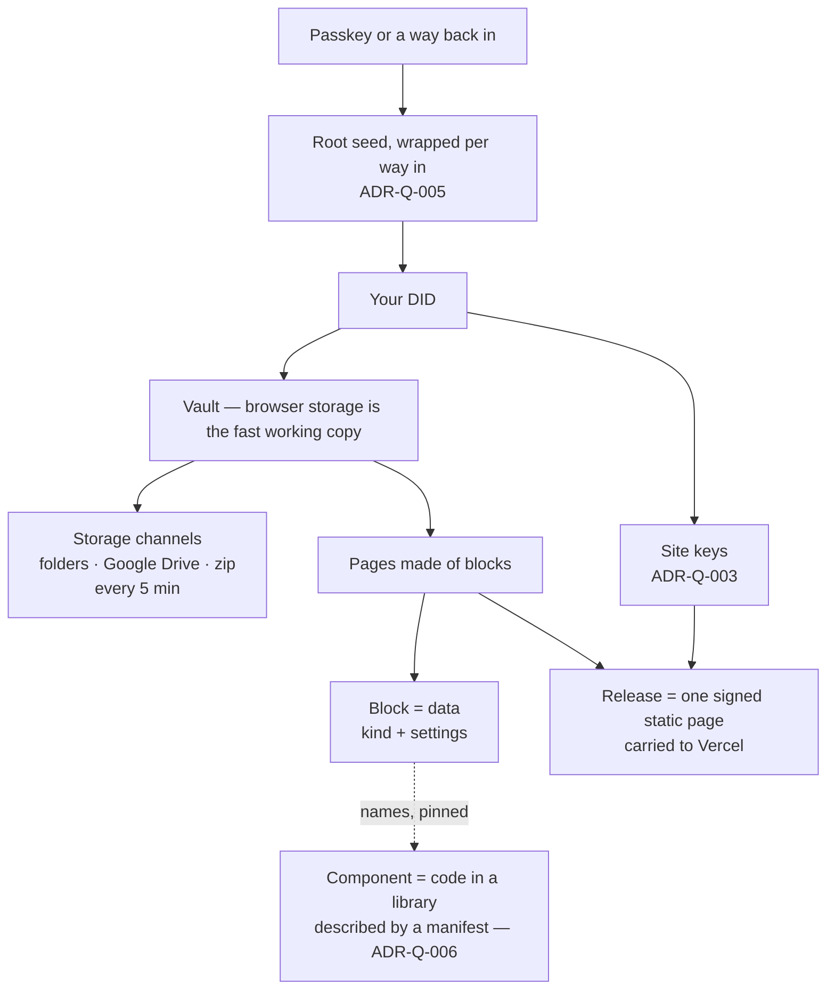

# Where we are — 28 September 2026

**The short version.** The vault is now honest and recoverable: backups are
checked before Q says so, a lost passkey is no longer the end, and the vault is
carried to your own folders and Google Drive every five minutes. The page
builder works for articles. The new layer is **components**: code lives in a
library, described by a manifest a person or a model can read, and a block
names a component rather than carrying code. Most of what comes next is UI
design and the plugin/manifest page builder.

This file joins two threads from 25 September: the **repo audit and storage
strategy** (doc: *Q audit — storage channels and the incubator doctrine*) and
**sign-in, components and the incubator's manifests** (ADR-Q-006). Read it
first; follow the links for detail. Every other doc's status is in
[`docs/README.md`](README.md).

---

## What Q is (unchanged)

Q reads and writes, verifies and accepts receipt evidence, and indexes it so
it is easy to find. The passkey comes first — there has to be a source to hash
from. It should feel the same on iPhone, the desktop app and the browser. All
editing and sign-in for Darren's sites happens in Q.

## How the pieces fit

Three kinds of channel share one receipt shape, with different rules:
**storage channels** reach your data, **contact channels** reach you,
**carriers** (Vercel) serve a public release. A provider is always a channel,
never an authority: *"provider destruction is channel failure — not authority
deletion."*

---

## Where things stand

| Area | State | Where |
|---|---|---|
| **Sign-in** | Passkey first. A way-in passkey or the recovery card opens the same DID (ADR-Q-005 steps 1–5, 7). Stays signed in across a reload for 30 quiet minutes. New calm sign-in on the home page: three big picture tiles, one big button, bold labelled icons — drawn as the component `q:sign-in@1.0.0`. The older `SignIn.svelte` is still used on Keys, Settings and the Q window. | `SignInBlock.svelte`, `SignIn.svelte`, `passkey.ts`, `continuity.ts` |
| **Continuity home** | Decided: Option B. The seed is wrapped for each passkey's PRF and for the recovery card, so a passkey is a replaceable carrier and the DID is no longer tied to one domain. `/network` says first if you have only one way in. **Worlds (step 6) not built.** | ADR-Q-005 |
| **Back up now** | Proven, not assumed: `backup.json` manifest with a root, the zip is read back and checked before it's handed over, "backed up" only after the share or download returns, a signed copy receipt (standing: *told*). Open from backup happens after the passkey and checks the backup is yours. Checked by Darren in the browser; **iPhone share sheet untested.** | `backup.ts`, `BackupButton.svelte` |
| **Storage channels** | One `StorageChannel` shape; folder channel (vault and copy locations); auto-sync every 5 minutes while Q is open; **Google Drive built** (PKCE, `drive.file`, refresh token sealed in the vault; consent screen still in Testing). Dropbox and OneDrive need app registrations. No bucket provider yet. | `storage-channels.ts`, `google-drive.ts`, `autosync.ts`, [`q/storage-channels.md`](q/storage-channels.md) |
| **Sites and publishing** | A site is its own key founded from your root. Publish is live: releases signed under the site key, carried to Vercel. The root, and so the site key, is recoverable once a second way in exists (ADR-Q-005) — which closes the audit's biggest risk only after you have made one. | ADR-Q-003, `sites.ts`, `releases.ts` |
| **Write (page builder)** | Full screen; palette where the menu was; drag and drop into and out of groups; Layout / Preview; block library (text, heading, picture, film, quote, gallery, columns, accordion, button, line, space, note); a Style panel from closed scales; a text view that loses nothing. Dark Olive draws every kind; the 18 existing pages come out byte-identical. | `lib/write/*`, `blocks.ts`, `style.ts`, [`q/block-controls-plan.md`](q/block-controls-plan.md) |
| **Components and manifests** | **New (uncommitted).** Manifest per component: what it may touch (closed list), promises, access rules (keyboard, labelled icons, reduced motion, 44px targets), a design brief, settings as questions. Tiers core / approved / draft. A `component` block pins an exact version. `describeComponent()` makes the brief a model reads. Steps 1–2 of 5 built. | ADR-Q-006, `components.ts`, `ComponentBlock.svelte`, `component-library.ts` |
| **Calls** | Peer to peer; a call is a hash-linked chain of receipts (facts only, no media). **Work not committed.** | ADR-Q-004, `calls.ts`, `lib/call/` |
| **Contact channels** | Email works (Resend). SMS returns 501. The per-instance limiter does nothing on serverless. No endpoint tests. | [`q/channels.md`](q/channels.md) |
| **Tested but unused** | `archive.ts`, `bands.ts`, `chain.ts`, `touches.ts`, `seaweedfs.ts`, `ways-in.ts`, `lifecycle.archiveDue`, `whatComesBack`. Good rules nothing calls yet. | [`q/what-is-real.md`](q/what-is-real.md) |
| **Federations** | **Drafts, founding and membership built 28 September** — founding (`/federations/draft`), invitations as a link or QR code, joining (at once on open/invite; request and acceptance on ask-to-join), leaving (member alone), removal (clause cited), timed suspension (ends on its own, a year at most); joining as a step-by-step consent form built from the federation's own blocks, choosing to be known anonymously, by name, or by name and picture (sealed to the federation). Every step checked by a core action: `federation.found`, `.join`, `.leave`, `.remove`. Blocks beyond the core, and renewing the caretaker, still to build. **Decided 28 September.** A federation is a key founded by a person (two signatures); a tiny core (agreement, joined/left/removed, a caretaker with a term) plus blocks that switch on when needed, each with its must and cannot; strands are presets. `federation.ts` is to be replaced, not patched. | ADR-Q-007 |
| **Actions and the engine** | **New (uncommitted).** Every action has must / may / cannot (a kernel principle), written as Cedar policies: one permit per may, a forbid per must and cannot; a federation adds forbids only. `packages/q-actions`: definition checker, hashing, derivation, AI-readable brief, and an engine with Cedar passed in. `money.spend` is the first core action. **25/25 tests pass; ~0.25 ms per decision. Rust (0.13 ms) and a Spin 4.1 component give identical hashes, decisions and rule ids.** | ADR-Q-008, ADR-Q-009, `packages/q-actions`, `spikes/cedar-*` |
| **Tests** | q-core: 410, 409 pass. The one failure is the uncommitted edit to `what-we-are-building-with-dostudy.json` (article roundtrip). | `pnpm --filter @inqbeta/q-core test` |

### Federations, actions and the rule engine (28 September)

Read the incubator's governance, membership and federation docs in full and
settled what they left open:

- **ADR-Q-007** — membership is belonging only (joined / left / removed
  receipts; leaving needs nobody's permission); offices are mandates with
  terms; elections produce mandates; seats by lot are the federation's choice;
  a fixed layer of principles no vote can change; legal forms (CIC, co-op,
  CIO) set a floor; strands are presets over blocks.
- **ADR-Q-008** — *must and cannot* as a kernel principle: every action's
  rules are content-addressed, checked by every reader, and only tighten.
- **ADR-Q-009** — actions are Cedar policies; the action index finds, the
  hash decides; the same Cedar in the browser (WASM) and on nodes (Rust in
  Spin); MQTT carries news, never evidence.

Proven on Darren's Mac: the `money.spend` spike, 11/11, refusals naming every
broken rule. Then `packages/q-actions` (25 tests). Cedar's browser build is
**4.3 MB (1.4 MB gzipped)** — load it only when something needs deciding,
not on first paint.

**Built later the same day:** signing in wakes the rule engine in its own
worker and loads the core actions (`apps/q/src/lib/actions/`); the service
worker keeps Cedar in a cache named by its version, fetched on first use and
kept across deploys; "Where your work is kept" shows the engine's state.
Ringing a call chose its direction: MQTT when awake, push to wake, the link
as fallback (ADR-Q-004 b).

Then on Darren's Mac: q-actions 25/25, and **Rust agrees with WASM on every
hash, decision and rule id** (`spikes/cedar-rust`), and so does a **Spin 4.1
component over HTTP** (`spikes/cedar-spin`) — one engine, same answer in the
browser, natively and on a node.

### Staying signed in on Safari (28 September)

A refresh now keeps you signed in on Safari. Found by console tracing: Safari
keeps Q's signing and vault keys across a reload but not the X25519 opening
key, and a record holding all four came back empty. Keys are now stored one
per record (`passkey.ts`); a refresh carries on without the opening key, and
the first sealed thing opened asks for one touch to rebuild it (`seal.ts`
`setOpeningSource`). The key's bytes are never stored. Also fixed on the way:
pages from an older build (the offline helper and a self-repair in `app.html`),
and the test site's address — Q is served at **inqbeta.dev**; each address has
its own browser storage, so use one per site.

### Leave no trace (27 September)

A button at the bottom of the dashboard clears everything Q keeps in this
browser — vault, sign-in, databases, caches, service worker — after checking
Google Drive holds all of it, and says plainly what it can't clear (a passkey
saved here, downloaded backups, history). `q-core/leave.ts`,
`LeaveNoTrace.svelte`, `/api/leave` (`Clear-Site-Data`), `static/gone.html`.
Darren's use: carry the vault on Drive, work anywhere, leave nothing behind.

### Not committed yet

Components work (ADR-Q-006, sign-in, `behaviour.ts`, block/page/renderer
changes, bold icons), calls (ADR-Q-004, `calls.ts`, `lib/call/`,
`routes/call/`, `routes/api/calls/`), `nav.ts`, `receipts.ts`, `ios/Setup.md`,
and three Dark Olive article edits. Commit or park these before the next big
change so the roundtrip test means something again.

---

## What the incubator taught us (25 September)

From `~/inQbeta/docs` (plugins, wiki manifests, recovery charter):

- **Keep:** describe before code (the Plugin Builder's guided questions);
  manifests as the contract; required declarations accepted explicitly;
  proposed → approved → activated → revoked, every step recorded; derivation
  only as a subset of the parent's powers; providers are channels; Find →
  Unlock → Sign → Reconnect.
- **Too restrictive:** only a core developer could add a new runtime template
  (one was ever built). A camping club needing bookings would have waited for
  us. ADR-Q-006 answers this: anyone may write a component, the manifest says
  what it may do, a sandbox makes that true, and the federation approves.
- **Never covered:** screen code running next to a passkey. Hence tiers —
  identity, vault and keys are core only.
- **Vocabulary to use:** storage channel, carrier, continuity home, holding.

---

## Next things to consider

### 1. Decisions only you can make

- [x] **Q's domain — decided 26 September.** As in the incubator, one root
  domain is the constant and everything sits under it. `inqbeta.local` stays
  the permanent *name* (schema ids). Passkeys belong to the real registered
  root, set as `PUBLIC_Q_PASSKEY_DOMAIN` (`passkey.ts` → `setPasskeyDomain`);
  unset on localhost and `*.vercel.app`, where passkeys are test identities.
  Root chosen: **inqbeta.com** (Q at inqbeta.com); test site **inqbeta.dev**.
  DNS at Namecheap → Vercel. **Both live since 27 September.** Steps: [`q/going-live.md`](q/going-live.md).
- [ ] **Licence audit**: what is public under which licence, and how Dark Olive
  keeps the copyright and the names without anything being proprietary. Open
  source, funded by donations and sponsorship.
- [ ] **Worlds** (ADR-Q-005 step 6): what a world is called at creation, and
  how Q shows which world is open. For real separation, the business passkey
  lives on a hardware key, not the same synced keychain.
- [ ] **Dropbox and OneDrive app registrations** (only the account owner can),
  and **publishing the Google consent screen** out of Testing.
- [ ] **First bucket provider** for a cold copy: Cloudflare R2, Backblaze B2 or
  Storj.
- [ ] **Tier names people read**: *here / synced / cold / archive*, or
  *working / syncing / kept / sealed away*.
- [ ] **Where a federation's shared state lives** (a camping club's booking
  calendar). The incubator used nodes; device-first Q hasn't decided. Gates
  components from other authors being useful.
- [x] **Who approves in a federation — decided 28 September.** Holders of a
  mandate for that action, granted by the federation's own rules (ADR-Q-007),
  checked as the action's rules (ADR-Q-009). `federation.ts` to be replaced.

### 2. UI design and function

- **One sign-in everywhere.** Move `SignIn.svelte`'s steps into a shared
  module used by `SignInBlock`, then use the component on Keys, Settings and
  the compact Q window. Its manifest's design brief is the spec.
- **Navigation tidy** — your stated next focus after sync.
- **A written design system** for Q's own screens, in the same form as a
  component's design brief: bold Lucide icons (stroke 2.25–3) always with a
  word, one question at a time, 44px targets, Skeleton presets and tokens
  only, nothing moves unless something is happening. Components then inherit
  it rather than restate it.
- **Honest status everywhere**: channels showing *checked / stale / told*, the
  backup button's colour from how many ways the vault can survive, not days.
- **Write**: per-site theme builder on Skeleton themes; per-screen visibility;
  uploading a picture straight into a block; credits and map components;
  projects all the way through (a website project with pages, theme, releases,
  Kanban; documents typed as proposals, legal documents, articles).

### 3. The plugin / manifest / page builder (ADR-Q-006 steps 3–5)

- **Step 3 — assemble first.** A Builder that asks what should happen
  (actions, rules, how value moves, safeguards) and joins existing components.
  Q already has the machinery: question sets drive every settings panel
  (`AskSet`), which is the incubator's permission interview in Q's form.
- **The component palette.** Components beside blocks in Write, each showing
  its tier, what it touches and its promises in plain words before it's added.
- **The approval screen.** A person approving reads the manifest as a brief
  (`describeComponent`), not code. Approval becomes a receipt signed with
  their DID; revocation likewise.
- **Step 4 — the sandbox.** Approved components in a sandboxed frame that can
  only ask Q for what the manifest declares; code hashes pinned in page
  receipts so a signed page means exactly what was signed. Pick the mechanism
  (sandboxed iframe + message bridge + CSP is buildable now).
- **Step 5 — other authors.** Shared catalogue; each federation approves for
  itself; derivation as a subset of powers.
- **Models as builders.** Every manifest stays AI-readable: a model reads the
  brief, must keep every line true, and changes the manifest before the code.
  This is where the free-to-use, pay-for-what-you-use AI plugin tool fits.

### 4. Vault and storage (audit phases 1–3, continued)

- Dropbox and OneDrive adapters, then the bucket adapter.
- A place record per channel, so `howSafe()` counts real fates.
- **Proven restore drill** (phase 3): pull from a channel, check the root, open
  the site keys, mark the channel *checked*; each channel checked within 30
  days or says it hasn't been.
- Cold and archive tiers using `archive.ts` and `archiveDue()`; only then
  publishing from the device.
- Test the share sheet on iPhone.

### 5. Documentation discipline

- `docs/README.md` now lists every doc and whether it is current.
- Still to do: front-matter (`implementation:`, `decision:`) on each doc, and
  a *Non-claims* section on ADR-Q-001 to 004.

## Suggested order

1. Commit or park the working tree (including `packages/q-actions` and
   `spikes/`); fix the roundtrip test.
2. One sign-in everywhere, then navigation.
3. Decide worlds, then build ADR-Q-005 step 6.
4. The design system written as a brief.
5. ADR-Q-006 step 3 (assemble first) with the component palette.
6. Dropbox and OneDrive once the apps are registered; then the restore drill.
7. Sandbox (step 4) only when a real federation needs outside components.
